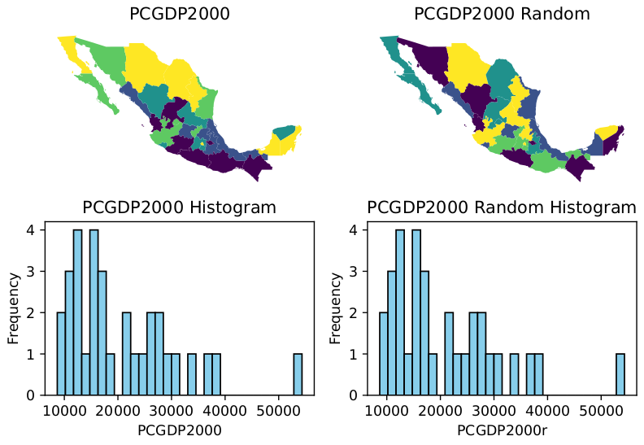

# Spatial Inequality Analysis

[Sergio J. Rey](http://sergerey.org)  
August 21, 2024




This Quarto project contains the source files and resources for the analysis of spatial inequality. The main document is `spatial_inequality.qmd`, which, when rendered, produces a PDF paper summarizing the findings.

## Project Structure

- **spatial_inequality.qmd**: The main Quarto document containing the analysis and paper.
- **references.bib**: The BibTeX file containing references cited in the paper.

## Dependencies
To replicate the analysis you will need to have the following installed:

- pysal 24.7 or greater
- quarto 1.5.56 or greater

## Rendering the Document

To render the document, you need to have Quarto installed. If you haven't installed Quarto yet, you can do so by following the instructions on the [Quarto website](https://quarto.org/docs/get-started/).

Once Quarto is installed, you can render the document to a PDF file by running the following command in the project directory:

```bash
quarto render spatial_inequality.qmd 
```


## Reading the document

- [pdf](http://sergerey.org/spatial_inequality/spatial_inequality.pdf)


